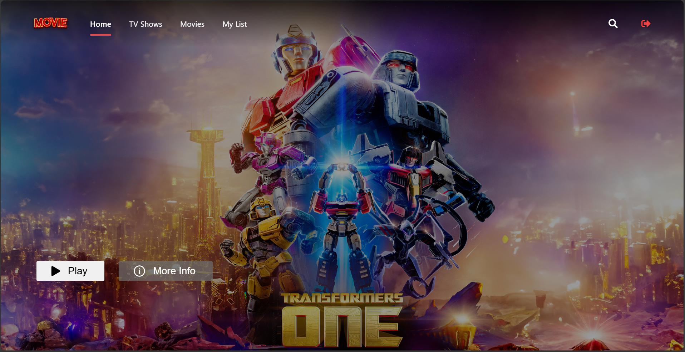
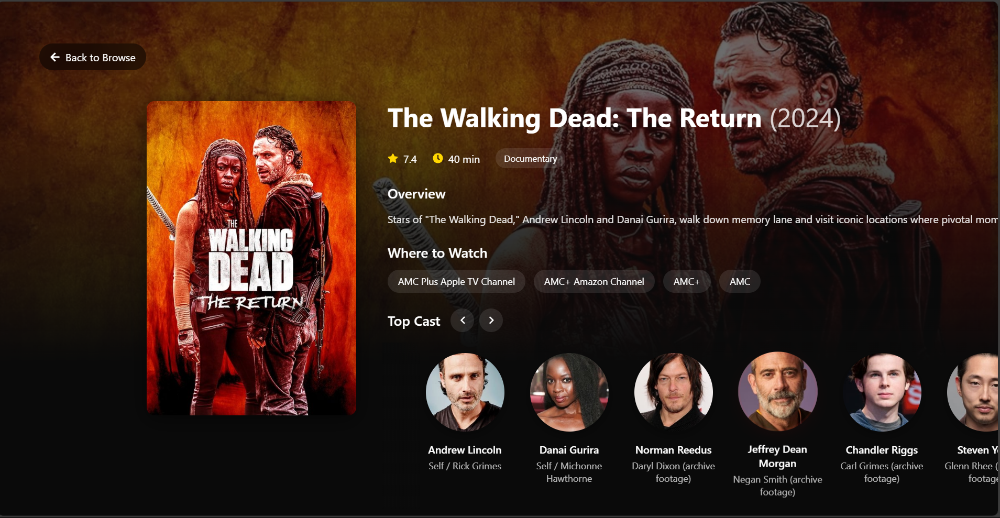
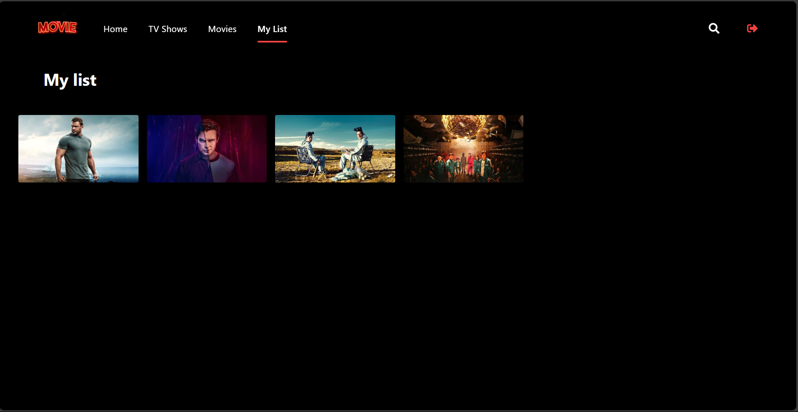
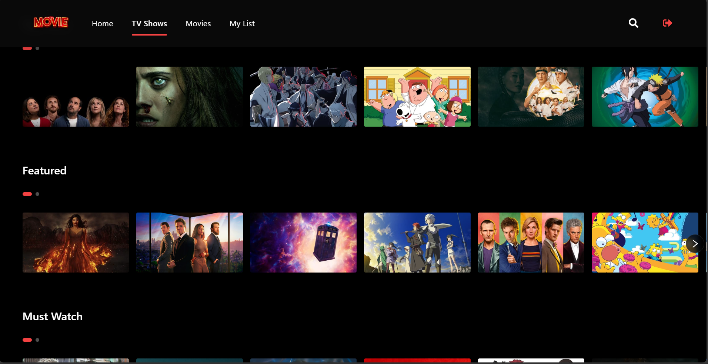

# Movie-Site-MERN
 
A full-stack **Movie Site** built using the **MERN stack** (MongoDB, Express.js, React.js, Node.js) with **Redux** for state management and **TypeScript** for better code scalability and maintainability.

## 🚀 Features
- Browse popular movies fetched from **TMDB API**
- Filter movies by genre
- User authentication (login/signup) with JWT
- Add movies to a personal watchlist
- Responsive UI using **React + Tailwind CSS**
- Backend built with **Node.js & Express.js**
- Database using **MongoDB + Mongoose**

## 🛠️ Tech Stack
### Frontend:
- React.js (with Redux Toolkit & TypeScript)
- Tailwind CSS
- Axios (for API requests)

### Backend:
- Node.js & Express.js
- MongoDB & Mongoose

## 📦 Installation & Setup
### Prerequisites
- Node.js & npm installed
- MongoDB running locally or using **MongoDB Atlas**

### 1️⃣ Clone the repository
```bash
git clone https://github.com/KavinduSenesh/Movie-Site-MERN.git
cd Movie-Site-MERN
```

### 3️⃣ Set up environment variables

```
PORT=5000
MONGO_URI=your_mongodb_connection_string
TMDB_API_KEY=your_tmdb_api_key
```

### 4️⃣ Run the application
#### Start backend server
```bash
cd server
npm run dev
```
#### Start frontend
```bash
cd client
npm start
```

## 📌 API Endpoints
| Method | Endpoint              | Description           |
|--------|----------------------|----------------------|
| GET    | /api/movies          | Fetch all movies     |
| GET    | /api/movies/:id      | Get a movie by ID    |
| POST   | /api/users/register  | Register a new user  |
| POST   | /api/users/login     | Login a user         |
| POST   | /api/watchlist       | Add movie to watchlist |
| DELETE | /api/watchlist/:id   | Remove from watchlist |

## 📷 Screenshots





## 🤝 Contributing
1. Fork the repository
2. Create a new branch (`git checkout -b feature-branch`)
3. Make your changes and commit (`git commit -m 'Add new feature'`)
4. Push to your fork (`git push origin feature-branch`)
5. Create a Pull Request

## 📜 License
This project is licensed under the **MIT License**.

## ✨ Acknowledgements
- [TMDB API](https://www.themoviedb.org/)
- [MERN Stack Documentation](https://www.mongodb.com/mern-stack)

---
Made by @[Kavindu Senesh](https://github.com/KavinduSenesh)

